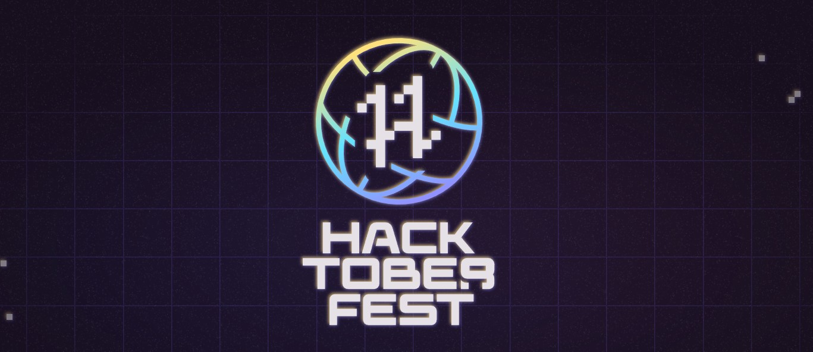

# CodeIN Community Website

  

<strong>CodeIN Community</strong> is one of India’s growing open-source-driven tech communities, supporting 15,000+ developers through mentorship, events, and collaborative learning.

  <a href="https://codeincommunity.com" target="_blank">Website</a> •
  <a href="https://discord.com/invite/sqFRzrj7f3" target="_blank">Discord</a> •
  <a href="https://www.linkedin.com/company/codein-community/" target="_blank">LinkedIn</a>

## Badges

  
  
  
  
  
  

  

## About The Community

CodeIN Community is a collaborative open-source learning ecosystem where students and early-career developers build projects, contribute to real repositories, and grow with peer support.

What we focus on:
- Open source programs and contribution drives
- Hackathons and project-based learning
- 1:1 and peer mentorship
- Tech opportunities, roadmaps, and resources

## OSS x Netlify Open Source Partnership

CodeIN Community is proud to be one of the OSS (Open Source Software) partners for Netlify.

As an open-source community partner, we use this website and our programs to:
- Encourage first-time contributors to enter open source
- Support community-built projects with modern web deployment workflows
- Create inclusive pathways for contributors to learn by shipping real work

This partnership reflects our mission: helping more developers discover, contribute to, and sustain open-source communities.

## Partnerships & Sponsorships

We welcome businesses, startups, and ecosystem partners who want to support open-source learning and community growth.

Organizations can support CodeIN Community through:
- Sponsorships for community programs, hackathons, and contributor initiatives
- Product or platform subscriptions for development, design, collaboration, and productivity
- AI credits (LLM/API/cloud credits) to help contributors build and ship real projects
- Event support, swag, learning resources, or mentorship collaborations

If your organization would like to partner with us, collaborate, or sponsor our initiatives, reach out to us at:
- Email: [codeincommunity@gmail.com](mailto:codeincommunity@gmail.com)

## Contributing

Contributions are welcome and appreciated.

1. Fork the repository.
2. Clone your fork.
3. Create a feature branch.
4. Make your changes.
5. Commit and push.
6. Open a pull request.

For full contribution workflow and standards, read:
- [Contributing Guide](./CONTRIBUTING.md)
- [Code of Conduct](./CODE_OF_CONDUCT.md)

## Contributors

  

## License

This project is licensed under the [MIT License](./LICENSE).

© 2026 CodeIN Community contributors.
